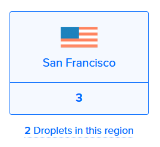

# ACIT 2420 Assignment 2

## Repository

*Aaron Zhang - A01316218*

### File Structure

## Step 1

### Create Infrastructure on Digital Ocean

#### VPC

  1. Under: Manage > Networking > VPC, click **Create VPC Network**
  2. Choose SFO3 as the datacenter region
  3. Name the VPC **vpc-2420** and finish creating the VPC

#### Load Balancer

  1. Under: Manage > Networking > Load Balancers, click **Create a Load Balancer**
  2. Choose San Francisco 3 as the datacenter region (you should see "2 Droplets in this region")
  
  3. Select the VPC **vpc-2420** you created earlier
  4. Under Scaling configuration, set **Number of nodes** to **2**
  5. Under Connect Droplets, add the tag **Web** and create the load balancer

#### Firewall

  1. Under: Manage > Networking > Firewalls, click **Create Firewall**
  2. Name the firewall **fw-2420**
  3. Under Inbound Rules, select **HTTP** as a new rule; replace existing sources with the name of the load balancer created earlier
  4. Under Apply to Droplets, enter the **Web** tag to link your droplets

## Step 2

Do the following procedure for both droplets:

### Add User to Droplets

  1. ssh into droplet as root
  2. Create a new user `useradd -ms /bin/bash <username>`
  3. Set a password for  user `passwd <username>`
  4. ssh into the droplet as the new user and set `PermitRootLogin` to `no` in `/etc/ssh/sshd_config`.
  5. Run `sudo systemctl restart ssh`

## Step 3

On both droplets:

### Install Caddy Web Server on Droplets

  1. `wget https://github.com/caddyserver/caddy/releases/download/v2.6.2/caddy_2.6.2_linux_amd64.tar.gz`
  2. `tar -xvf caddy_2.6.2_linux_amd64.tar.gz`
  3. `sudo chown root: caddy`
  4. `sudo cp caddy /usr/bin/`

## Step 4

### Create Document

  1. On local machine, create a directory called **assignment_2**
  2. Inside **assignment_2/**, create directory **html**
  3. Inside **html/**, create file **index.html** and add some boilerplate HTML:
  

### Create Web App

  1. Inside **assignment_2/**, create directory **src**
  2. `npm init` on **src/**
  2. `npm install fastify` on **src/**
  3. Create file **index.js** in **src/** and add the following code:
  
  4. Test web app locally and ensure that **index.html** is served successfully
  5. Move **html/** and **src/** to both droplets (use rsync or sftp)
  6. `sudo mkdir /var/www` then `sudo mv html/index.html /var/www/`

## Step 5

### Create Caddyfile

On local machine:

  1. Create a file named **Caddyfile**
  3. Add the following to the **Caddyfile** (use the IP of the load balancer created earlier):
  

## Step 6

On both droplets:

### Install Node with Volta

  1. `curl https://get.volta.sh | bash`
  2. Restart terminal, `source ~/.bashrc`
  3. `volta install node`

## Step 7

On local machine:

### Create Service File
  1. Create a file named **caddyapp.service** and write:
  

## Step 8

For both droplets:

### Upload and Move Files

  1. Upload **Caddyfile** and **caddyapp.service**
  2. `sudo mkdir /etc/caddy`
  3. `sudo mv Caddyfile /etc/caddy/Caddyfile`
  4. `sudo mv caddyapp.service /etc/systemd/system`

### Start and Test caddyapp.service

  1. `sudo systemctl daemon-reload`
  2. `sudo systemctl enable caddyapp.service`
  3. `sudo systemctl start caddyapp.service`
  4. `systemctl status caddyapp.service`

